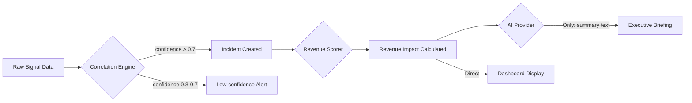

# Revenue Leak Radar — System Architecture

## Overview

Revenue Leak Radar is an enterprise operational intelligence platform that correlates engineering incidents with business revenue impact in real time.

**Core Question Answered:** *"Which technical incident is causing the highest business damage right now?"*

---

## High-Level Architecture

```mermaid
graph TD
    subgraph External["External Systems (Simulated in Phase 1)"]
        GH[GitHub Deployments]
        SE[Sentry Errors]
        ST[Stripe Payments]
        ZD[Zendesk Tickets]
        DD[Datadog Alerts]
    end

    subgraph Backend["Backend — FastAPI"]
        CE[Correlation Engine\nDETERMINISTIC]
        RS[Revenue Scorer\nDETERMINISTIC]
        AP[AI Provider\nGemini | Groq | OpenRouter]
        DB[(PostgreSQL)]
        API[REST API /api/v1]
    end

    subgraph Frontend["Frontend — Next.js"]
        DB_PAGE[Dashboard]
        INC[Incidents]
        REV[Revenue Risk]
        EXEC[Executive Reports]
        TL[Timeline]
        SH[System Health]
    end

    External -->|Ingested via /alerts, /deployments| Backend
    CE --> RS
    RS --> AP
    AP -->|JSON summaries only| DB
    CE --> DB
    RS --> DB
    API --> DB
    Frontend --> API
```

---

## Module Responsibilities

### Backend Modules

| Module | Type | Responsibility |
|--------|------|---------------|
| `correlation_engine.py` | Deterministic | Links deployments to incidents via temporal + signal correlation |
| `revenue_scorer.py` | Deterministic | Calculates revenue at risk using customer MRR + payment failure data |
| `ai_provider.py` | AI | Calls Gemini/Groq/OpenRouter for summaries only |
| `routers/incidents.py` | API | CRUD + correlation trigger |
| `routers/revenue.py` | API | Revenue calculations + trends |
| `routers/executive_summaries.py` | API | AI-generated briefings |
| `routers/remediation.py` | API | Remediation plan generation + status tracking |

### Frontend Pages

| Page | Route | Data Source |
|------|-------|------------|
| Dashboard | `/` | `/api/v1/incidents/dashboard/kpis` |
| Incidents | `/incidents` | `/api/v1/incidents` |
| Revenue Risk | `/revenue-risk` | `/api/v1/revenue/at-risk` |
| Executive Reports | `/executive-reports` | `/api/v1/executive/latest` |
| Timeline | `/timeline` | `/api/v1/incidents/{id}` with events |
| System Health | `/system-health` | `/health` + `/api/v1/alerts` |

---

## Deterministic Intelligence Layer

**LLMs are used ONLY for:**
- Executive summary text generation
- Remediation step description generation
- Incident narrative explanation

**LLMs are NEVER used for:**
- Incident severity calculation
- Revenue impact scoring
- Incident prioritization
- Correlation confidence calculation
- Business decisions



---

## Phase 2 Core Observability Engines

### 1. Ingestion Engine (`event_ingestion.py`)
Responsible for raw operational event processing:
* **Validation & Log Persistence**: Persists raw ingested metadata into the `operational_events` log.
* **Routing**: Normalizes and dispatches to specialized tables:
  * `deployment` -> `deployments`
  * `payment_failure` -> `payment_failures`
  * `support_ticket` / `customer_complaint` -> `support_tickets`
  * `infrastructure_alert` / `error_spike` / `sla_violation` -> `alerts`
  * `remediation_action` -> `remediation_actions`
* **Trigger**: Prompts correlation run for the newly routed signal.

### 2. Correlation Engine (`correlation_engine.py`)
Rule-based time-window clustering logic:
* **Temporal Grouping**: Groups alerts, payment failures, and tickets occurring within a rolling 30-minute window.
* **Culprit Deployment Mapping**: Automatically scans for production deployments of the matching repository occurring up to 60 minutes *preceding* the incident start.
* **Remediation Workflows**: Auto-creates `RemediationAction` recommendations (e.g. rollback, Slack alert, Jira ticket) for Critical/High severity outages.

### 3. Revenue Scorer (`revenue_scorer.py`)
Computes business impact deterministically:
* **Tier-Weighted MRR**: Extracts MRR of affected customers, applying tier-weighted multipliers (Enterprise = 10x, Premium = 3x, Standard = 1x, Trial = 0.1x).
* **Payment Failures Annualization**: Calculates daily rate of failed transactions based on incident exposure duration.
* **Sigmoid Churn Premium**: Estimates churn probability from duration and signal-density surge, adding it to total daily risk.

### 4. Simulation Manager (`simulation_manager.py`)
Feeds the event ingestion pipeline step-by-step for 6 distinct demo scenarios:
* **Checkout Deployment Failure** (Sarah Chen's production code deploy triggering Stripe payload mismatches).
* **Auth Latency / Timeout Outage** (DB pool locking auth queries).
* **Stripe Payment Gateway Degradation** (External gateway timeouts).
* **Enterprise SLA Performance Alert** (SLA breaches on dedicated nodes).
* **Silent Subscription renewal declines** (Silent MRR churn leak).
* **Checkout Performance Latency Spike** (checkout page slowdown).

### 5. Incident Memory Similarity Engine (`incident_memory.py`)
Provides deterministic similarity matching against resolved past outages:
* **Overlaps**: Scans past resolved/closed incidents.
* **Score Multipliers**: Weights codebase repository overlaps (0.4), error and alert signature keywords (0.4), and direct payment conversion failure symptoms (0.2).
* **RCA Recurrence**: Yields exact matches and reasons to aid debugging and avoid duplicate triaging.

### 6. Role Briefings Router (`executive_summaries.py`)
Bridges structured system prompt templates in `agent-prompts` package with target roles:
* **CTO Engineering RCA**: Focuses on commit hashes, backend anomalies, Sentry exceptions, database locks, and immediate rollbacks.
* **Board Financial Update**: Focuses on commercial risk, MRR exposure, contractual SLA penalties, and business mitigations.
* **Customer Support Update**: Focuses on public headline alerts and empathetic status updates without exposing internal technical telemetry.

---

## Data Flow

```
1. Event Ingestion
   POST /api/v1/deployments  →  deployments table
   POST /api/v1/alerts       →  alerts table

2. Correlation (Deterministic)
   correlation_engine.py
   - Checks: deployment timing vs alert onset (< 30min = high confidence)
   - Aggregates: payment_failures + support_tickets in time window
   - Returns: CorrelationResult {confidence, signals, deployment_id}

3. Revenue Scoring (Deterministic)
   revenue_scorer.py
   - Formula: Σ(customer.mrr × tier_weight × failure_probability)
   - Tier weights: enterprise=10x, premium=3x, standard=1x
   - Churn probability: f(duration, ticket_surge, payment_failure_rate)

4. AI Summarization (Optional, structured JSON only)
   ai_provider.py
   - Input: typed incident data + revenue calculations
   - Output: {summary_text, key_risks[], recommended_actions[]}
   - Validated against Pydantic schema before storage

5. API Response
   GET /api/v1/incidents  →  sorted by estimated_revenue_impact_daily DESC
   GET /api/v1/revenue/at-risk  →  aggregate revenue exposure

6. Frontend Display
   Dashboard → Revenue Risk Table → sorted by $$/day
```

---

## AI Provider Architecture

```python
# Priority chain (first available key wins)
PROVIDER_PRIORITY = ["gemini", "groq", "openrouter", "mock"]

# Gemini (Primary)
endpoint: https://generativelanguage.googleapis.com/v1beta/models/{model}:generateContent
free_tier: Yes (gemini-1.5-flash)

# Groq (Secondary — fastest free tier)
endpoint: https://api.groq.com/openai/v1/chat/completions
free_tier: Yes (llama-3.1-8b-instant)

# OpenRouter (Tertiary)
endpoint: https://openrouter.ai/api/v1/chat/completions
free_tier: Yes (meta-llama/llama-3.1-8b-instruct:free)

# Mock (Development fallback — no API key needed)
Returns: Hardcoded realistic JSON responses
```

---

## Database Schema

See `docs/database-schema.md` for full ERD and table definitions.

**Core relationships:**
```
deployments ←── incidents (deployment_id FK, nullable)
incidents   ←── alerts          (incident_id FK, nullable)
incidents   ←── payment_failures (incident_id FK, nullable)
incidents   ←── support_tickets  (incident_id FK, nullable)
incidents   ──→ revenue_event    (incident_id FK, unique)
incidents   ──→ remediation_actions[] (incident_id FK)
customers   ←── payment_failures (customer_id FK)
customers   ←── support_tickets  (customer_id FK)
```

---

## API Contract

All responses follow this envelope:

```json
{
  "success": true,
  "data": { ... },
  "message": "Optional human-readable message",
  "timestamp": "2024-01-15T14:32:00Z"
}
```

Error responses:
```json
{
  "success": false,
  "error": "Machine-readable error code",
  "detail": "Human-readable explanation",
  "timestamp": "2024-01-15T14:32:00Z"
}
```

---

## Scalability Notes

Phase 1 is optimized for demo quality and rapid development.

Future scaling options (Phase 3+):
- Add WebSocket for real-time dashboard updates
- Add Redis pub/sub for alert fan-out
- Add Celery for async revenue calculations
- Add pgbouncer for connection pooling

None of these are required for demo or initial production use.
