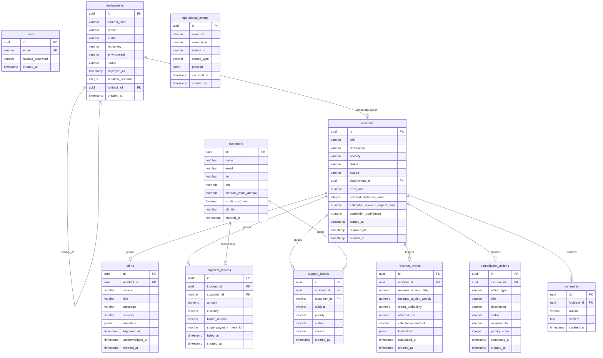

# Revenue Leak Radar — Database Schema

This document outlines the PostgreSQL database schema for the Revenue Leak Radar platform.

## ER Diagram (Mermaid)

## Table Specifications

### 1. `users`
Tracks users authenticated on the platform interface.
* `id` (UUID, Primary Key)
* `email` (VARCHAR, Unique, Indexed)
* `hashed_password` (VARCHAR)
* `created_at` (TIMESTAMP)

### 2. `customers`
Stores client details, recurring contracts, and service SLA parameters.
* `id` (UUID, Primary Key)
* `name` (VARCHAR)
* `email` (VARCHAR)
* `tier` (VARCHAR, Enum: Enterprise, Premium, Standard, Trial)
* `mrr` (DECIMAL)
* `contract_value_annual` (DECIMAL, Nullable)
* `is_sla_customer` (BOOLEAN)
* `sla_tier` (VARCHAR, Nullable)

### 3. `deployments`
Logs git deployments pushed across codebase repositories.
* `id` (UUID, Primary Key)
* `commit_hash` (VARCHAR)
* `branch` (VARCHAR)
* `author` (VARCHAR)
* `repository` (VARCHAR)
* `environment` (VARCHAR, Enum: Production, Staging, Development)
* `status` (VARCHAR, Enum: Success, Failed, Rolled_Back)
* `deployed_at` (TIMESTAMP)
* `duration_seconds` (INTEGER, Nullable)
* `rollback_of` (UUID, Foreign Key referencing `deployments.id`, Nullable)

### 4. `incidents`
Aggregated causal outage nodes, automatically computed by the Coral correlation engine.
* `id` (UUID, Primary Key)
* `title` (VARCHAR)
* `description` (TEXT)
* `severity` (VARCHAR, Enum: Critical, High, Medium, Low)
* `status` (VARCHAR, Enum: Active, Investigating, Mitigating, Resolved, Closed)
* `source` (VARCHAR)
* `deployment_id` (UUID, Foreign Key referencing `deployments.id`, Nullable)
* `error_rate` (DECIMAL) - Errors/min peak
* `affected_customer_count` (INTEGER)
* `estimated_revenue_impact_daily` (DECIMAL)
* `correlation_confidence` (DECIMAL)
* `started_at` (TIMESTAMP)
* `resolved_at` (TIMESTAMP, Nullable)

### 5. `alerts`
Infrastructure alerts (e.g. Sentry exceptions, Datadog latency triggers).
* `id` (UUID, Primary Key)
* `incident_id` (UUID, Foreign Key referencing `incidents.id`, Nullable)
* `source` (VARCHAR)
* `title` (VARCHAR)
* `message` (TEXT)
* `severity` (VARCHAR)
* `metadata` (JSONB)
* `triggered_at` (TIMESTAMP)
* `acknowledged_at` (TIMESTAMP, Nullable)

### 6. `payment_failures`
Billing declination events (e.g. Stripe card decline webhook hooks).
* `id` (UUID, Primary Key)
* `incident_id` (UUID, Foreign Key referencing `incidents.id`, Nullable)
* `customer_id` (VARCHAR)
* `amount` (DECIMAL)
* `currency` (VARCHAR)
* `failure_reason` (VARCHAR)
* `stripe_payment_intent_id` (VARCHAR)
* `failed_at` (TIMESTAMP)

### 7. `support_tickets`
Client support requests (e.g. Zendesk queue tickets).
* `id` (UUID, Primary Key)
* `incident_id` (UUID, Foreign Key referencing `incidents.id`, Nullable)
* `customer_id` (VARCHAR)
* `subject` (VARCHAR)
* `priority` (VARCHAR)
* `status` (VARCHAR)
* `source` (VARCHAR)

### 8. `revenue_events`
Deterministic business loss evaluations and estimates triggered by operational outages.
* `id` (UUID, Primary Key)
* `incident_id` (UUID, Foreign Key referencing `incidents.id`, Unique)
* `revenue_at_risk_daily` (DECIMAL)
* `revenue_at_risk_weekly` (DECIMAL)
* `churn_probability` (DECIMAL)
* `affected_mrr` (DECIMAL)
* `calculation_method` (VARCHAR)
* `breakdown` (JSONB)
* `calculated_at` (TIMESTAMP)

### 9. `remediation_actions`
Remediation and response plans, recommended automatically or custom built.
* `id` (UUID, Primary Key)
* `incident_id` (UUID, Foreign Key referencing `incidents.id`)
* `action_type` (VARCHAR, Enum: Rollback, Alert, Ticket, Notification)
* `title` (VARCHAR)
* `description` (TEXT)
* `status` (VARCHAR, Enum: Pending, In_Progress, Completed, Failed)
* `assigned_to` (VARCHAR, Nullable)
* `priority_order` (INTEGER)
* `completed_at` (TIMESTAMP, Nullable)

### 10. `operational_events`
The audit ledger logging all streaming state events processed by the ingestion loop.
* `id` (UUID, Primary Key)
* `event_id` (VARCHAR)
* `event_type` (VARCHAR)
* `source_id` (VARCHAR)
* `source_type` (VARCHAR)
* `payload` (JSONB)
* `occurred_at` (TIMESTAMP)

### 11. `comments`
Collaboration notes written in the Incident War Room.
* `id` (UUID, Primary Key)
* `incident_id` (UUID, Foreign Key referencing `incidents.id`)
* `author` (VARCHAR)
* `content` (TEXT)
