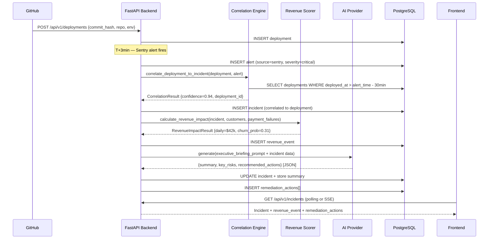

# Revenue Leak Radar — Event Lifecycle

## Overview

Every observable business event in Revenue Leak Radar flows through a deterministic 7-stage lifecycle.

---

## Full Event Lifecycle



---

## Event Types

### 1. `deployment_created`
**Trigger:** New deployment ingested via API  
**Data:** `{deployment_id, commit_hash, repository, environment, deployed_at}`  
**Next:** Stored. Awaits correlated signal within correlation window (30min).

---

### 2. `error_spike_detected`
**Trigger:** Alert ingested with severity=critical|high AND error_rate > threshold  
**Data:** `{alert_id, source, error_rate, endpoint, triggered_at}`  
**Next:** Correlation engine checks for recent deployments.

---

### 3. `payment_failures_increased`
**Trigger:** Multiple payment failures detected in short window (> 10 failures/5min)  
**Data:** `{failure_count, total_amount, failure_reason, customer_ids[]}`  
**Next:** Added as correlation signal. Increases revenue estimate.

---

### 4. `incident_generated`
**Trigger:** Correlation engine returns confidence > 0.5  
**Data:** `{incident_id, severity, correlation_confidence, deployment_id}`  
**Next:** Revenue scorer runs immediately.

---

### 5. `revenue_impact_calculated`
**Trigger:** Revenue scorer completes for an incident  
**Data:** `{incident_id, revenue_at_risk_daily, affected_mrr, churn_probability, breakdown}`  
**Next:** Dashboard updates. AI briefing triggered if severity=critical.

---

### 6. `remediation_triggered`
**Trigger:** Incident created with severity=critical|high (automatic) or manual trigger  
**Data:** `{incident_id, actions[], rollback_recommended, estimated_resolution_minutes}`  
**Next:** Actions dispatched (Slack notification, Jira ticket creation).

---

### 7. `executive_summary_generated`
**Trigger:** AI provider returns structured briefing  
**Data:** `{summary_text, key_risks[], recommended_actions[], operational_status}`  
**Next:** Stored in DB. Available via GET /api/v1/executive/latest.

---

### 8. `incident_resolved`
**Trigger:** Manual status update to "resolved" OR automated rollback detection  
**Data:** `{incident_id, resolved_at, resolution_method, final_revenue_impact}`  
**Next:** Revenue event closed. Remediation actions marked complete.

---

## Correlation Algorithm

```python
def correlate_deployment_to_incident(deployment, error_spike_time):
    delta_minutes = (error_spike_time - deployment.deployed_at).total_seconds() / 60

    if delta_minutes < 0:
        return 0.0  # Deployment after error — no correlation

    if delta_minutes < 5:
        return 0.95  # Very tight temporal correlation
    elif delta_minutes < 15:
        return 0.85
    elif delta_minutes < 30:
        return 0.70
    elif delta_minutes < 60:
        return 0.45
    else:
        return 0.15  # Low confidence — possible unrelated incident
```

---

## Revenue Scoring Formula

```python
def calculate_revenue_impact(incident, payment_failures, customers):
    TIER_WEIGHTS = {
        "enterprise": 10.0,
        "premium": 3.0,
        "standard": 1.0,
        "trial": 0.1,
    }

    # Base: payment failure rate × daily transaction volume
    payment_daily = sum(pf.amount for pf in payment_failures) * (24 * 60 / incident.duration_minutes)

    # MRR at risk: weighted by customer tier
    mrr_at_risk = sum(
        customer.mrr * TIER_WEIGHTS[customer.tier]
        for customer in affected_customers
    ) * churn_probability

    return {
        "revenue_at_risk_daily": payment_daily + (mrr_at_risk / 30),
        "revenue_at_risk_weekly": (payment_daily + mrr_at_risk / 30) * 7,
        "churn_probability": calculate_churn_prob(incident, tickets, failures),
    }

def calculate_churn_prob(incident, tickets, failures):
    base = 0.05
    if incident.severity == "critical":
        base += 0.15
    if len(tickets) > 20:
        base += 0.08
    if len(failures) > 50:
        base += 0.10
    duration_hours = incident.duration_minutes / 60
    if duration_hours > 2:
        base += 0.05 * min(duration_hours - 2, 4)
    return min(base, 0.80)
```
